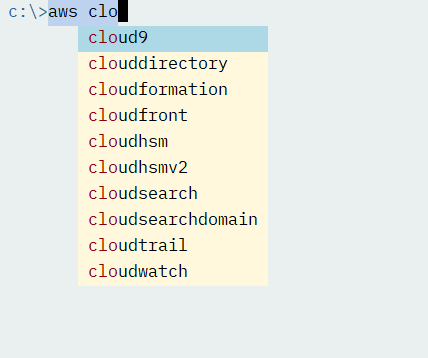
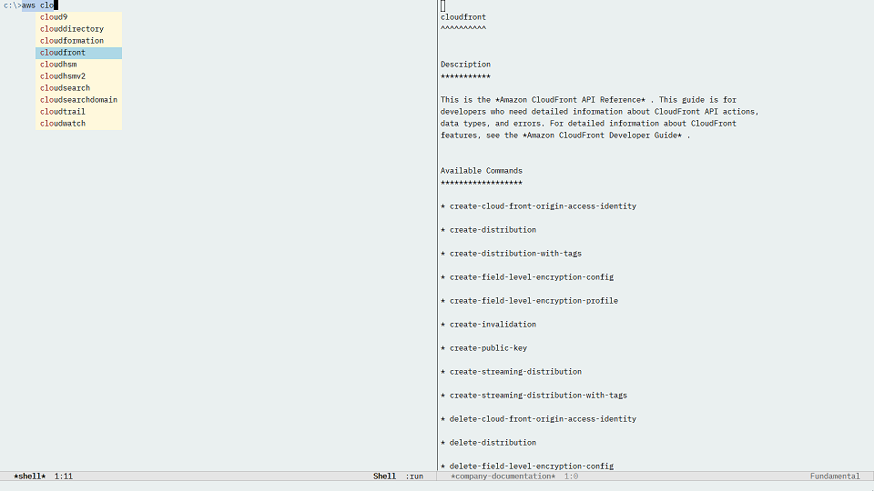
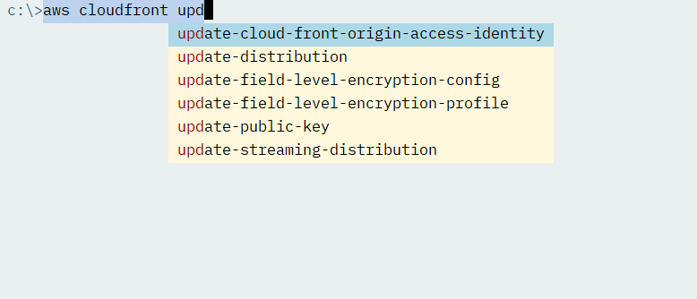
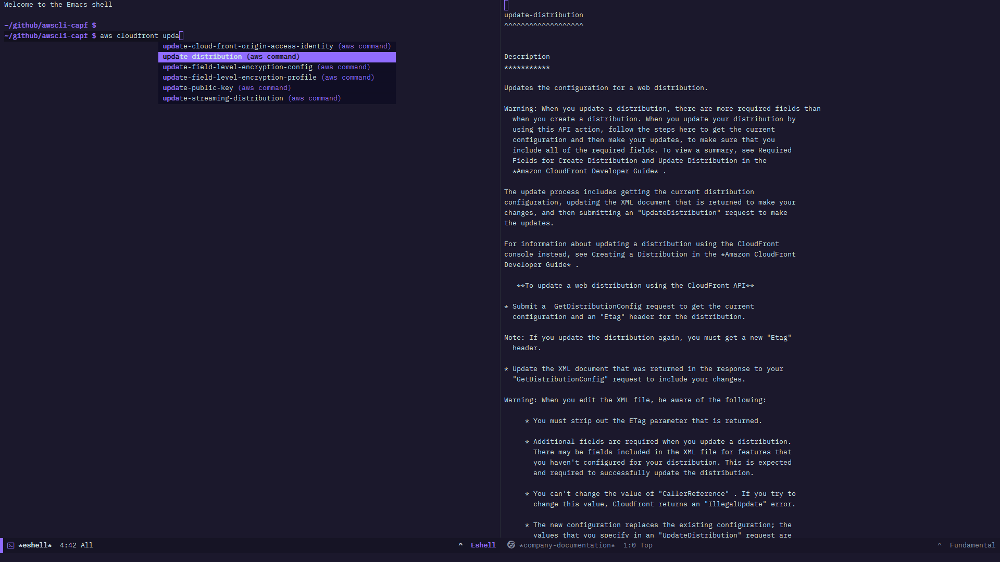
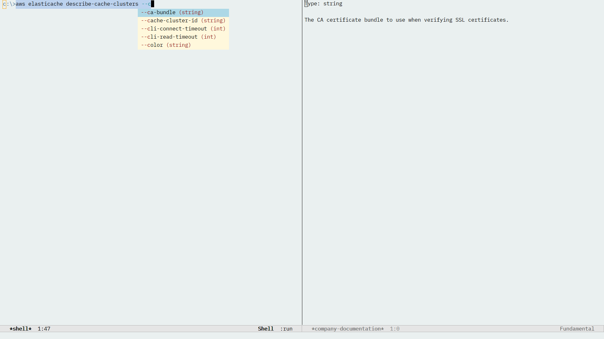
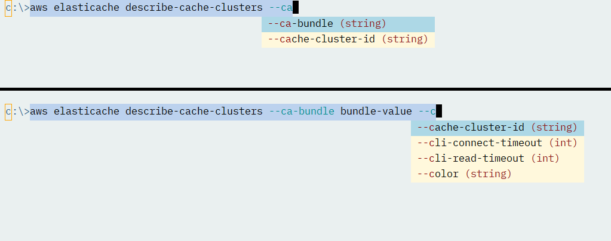

[](https://melpa.org/#/awscli-capf)

# AWS CLI - Completion at point

The AWS command line tool has a support for all of Amazon services, with tens of commands for each one.
I considered creating a wrapper for it, using for example Transient. But with so many commands, it seemed too daunting a task.
Plus, I'm not familiarized with all of them. I don't think any individual has used all the tool has to offer!  

But what if, instead, we could have support for completion, with quick access to the vast documentation in the AWS CLI? Then when you type
`aws` in your shell buffer, completion at point would suggest valid commands. And by leveraging some company-mode extensions, the docs
are one `C-h` away!

## Table of contents

<!--ts-->

   * [Installation and configuration](#installation-and-configuration)
   * [Refreshing completion data](#refreshing-completion-data)
   * [Adding completion to a mode](#adding-completion-to-a-mode)
   * [Screenshots](#screenshots)

<!--te-->

## Installation and configuration

Place awscli-capf.el in your `load-path`. Optionally, add awscli-capf-docs.data in the same directory. (MELPA submission coming soon).

## Refreshing completion data

If you don't want to use the pre-generated completion data in awscli-capf-docs.data, then after loading `awscli-capf` 
you can invoke the command `awscli-capf-refresh-data-from-cli`.
This command will run `aws help` and use regular expressions to go over the output and get the list of services.
Then for each service it will execute `aws [service] help` and so on for each combination of service and command.

This can take quite a while! And it's the less robust part of the process, to be honest. If in the future the documentation
format changes, the functions parsing the output will need to be adjusted. (see [issue #6](https://github.com/sebasmonia/awscli-capf/issues/6) for 
a not-yet-implemented alternative)

## Adding completion to a mode

Add the function `awscli-capf` to the list of completion functions, for example:

```elisp
(require 'awscli-capf)

(add-hook 'shell-mode-hook (lambda ()
                             (add-to-list 'completion-at-point-functions 'awscli-capf)))
;; --or

(add-hook 'shell-mode-hook 'awscli-capf-add)
```

Or with `use-package` and using the convenience function in `awscli-capf`:

```elisp
;; You should skip load-path when installed from MELPA
(use-package awscli-capf :load-path "/path/to/awscli-capf.el"
  :commands (awscli-capf-add)
  :hook (shell-mode . awscli-capf-add))
```

## Screenshots

After typing "aws", the first step is completion of service names:



You can press `C-h` over a candidate to see its docs:



_Don't forget `C-M-v` to "scroll the other window". Convenient!_

Same applied for commands, after picking a service:





Finally, for parameters, the docs include the type. Also, parameters already used
are removed from the suggestion list:




